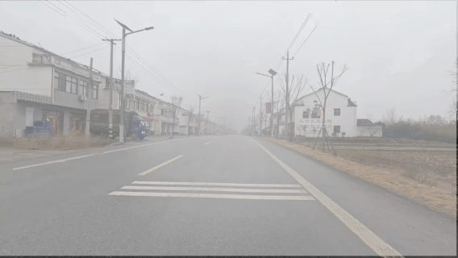
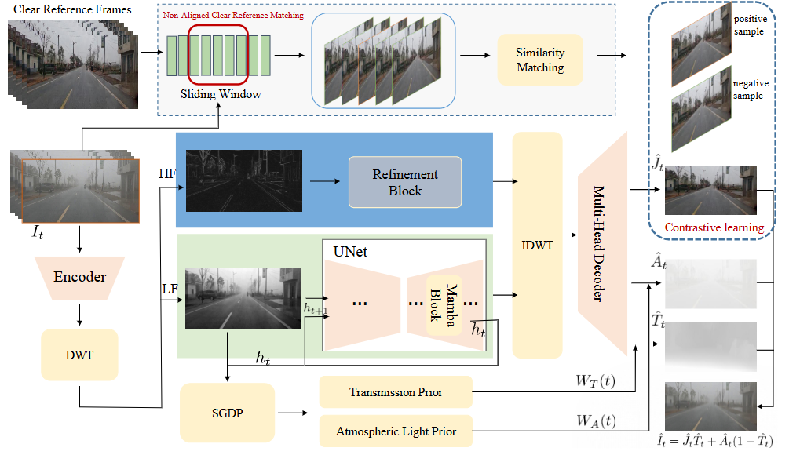

# Implicitly Aligned Video Dehazing via Frequency-Aware Recursive Mamba

In this work, we present a frequency-aware video dehazing framework built upon State Space Models (SSM), which leverage linear-time sequence modeling with recursive hidden states to establish implicit spatio-temporal dependencies, thereby avoiding costly motion estimation. To better separate haze degradation from structural details, we incorporate wavelet decomposition for frequency-domain decoupling: low-frequency components are restored with strong temporal modeling, while high-frequency components preserve fine textures and edges.

# video demo:

# Pipeline:

The code will be coming soon. Stay tuned!
